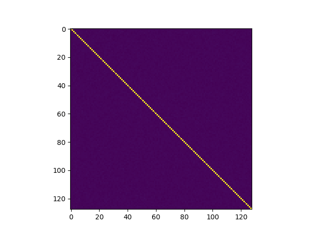

# Statistically Acceptable GAussians (SAGA)


Authored by James Howe, Thomas Prest, Thomas Ricosset, and Mélissa Rossi - 27-Jan-2020

Code from the paper available at: https://eprint.iacr.org/2019/1411

## Introduction

SAGA (Statistically Acceptable GAussians) is a test suite proposal for verfying statistical correctness for univariate and multivariate Gaussians. The paper accompanying this code has been published at PQCrypto 2020 and is also available on [ePrint](https://eprint.iacr.org/2019/1411). The following will briefly describe how to setup and use the python script.

## Installation

This standalone implementation should be able to run on most machines. We have provided a `requirements.txt` file to install all the dependencies; install these can be done by simple running `pip install -r requirements.txt` for Python 2 or `pip3 install -r requirements.txt` for Python 3.

## How to use

Along with the main file to run these statistical tests, `saga.py`, we also provide code for our proposed sampler [1] in the files `sampler.c`, `sampler.py`, where `sampler_rep.py` is a file we use to get data on the repetition rate. We also provide [falcon/](code/falcon) and [testdata/](code/testdata) for python implementations of [Falcon](https://falcon-sign.info/) and its output values.

#### Example for UnivariateSamples

Suppose we want to test the normality of a (Python) list of *univariate* samples stored in `data`, with *expected* center `mu` and *expected* standard deviation `sigma`. This can be done by this snippet of code in Python:

```python
>>> import saga                      # import the test suite
>>> mu = -0.920619
>>> sigma = 1.711864
>>> data = [-1, 2, -4, 0, -2, 1, -2, -3, -1, 1, -1, 0, 0, 1, -4, -1, -2, -2, -1, 0, 1, -1, 2, -3, 2, 0, -1, -2, 0, -3, -1, -2, -1, 1, -5, -1, -2, -2, -1, 0, 2, 1, 0, 0, 1, -1, -2, -2, -1, 0, 2, -2, -1, -3, 0, 0, 0, -2, 0, 0, 0, -3, -4, 0, 1, -1, 0, -1, 1, -3, 0, 0, -3, 0, -4, -1, -2, 0, 0, -2, -2, -1, 1, -1, 0, -2, -2, -2, 0, -1, -4, -2, 0, -2, -2, 1, -1, 0, -3, -1]
>>>
>>> res = saga.UnivariateSamples(mu, sigma, data)
>>> res

Testing a Gaussian sampler with center = -0.920619 and sigma = 1.711864
Number of samples: 100

Moments  |   Expected     Empiric
---------+----------------------
Mean:    |   -0.92062      -0.92000
St. dev. |   1.71186      1.51446
Skewness |   0.00000      -0.25650
Kurtosis |   0.00000      -0.26704

Chi-2 statistic:   4.033416341364921
Chi-2 p-value:     0.4015023295495953   (should be > 0.001)

How many outliers? 0

Is the sample valid? True
```

This creates an object `res`, and printing `res` gives expected and empiric moments (of order 1 to 4), a Chi-square p-value and the number of outliers (samples outside of the expected bounds). Here we can see that the samples are not rejected by our tests.

#### Example for multivariate samples

Now suppose we want to test the normality of a (Python) list of *multivariate* samples stored in `list_sig`, with *expected* center 0 and *expected* standard deviation `exp_sig`. For simplicity and because it applies to most multivariate samplers, the expected center is always considered as zero. One can still translate the samples if the expected center is nonzero. For replicability, we generated `list_sig` by parsing raw data contained in the 39.2 MB file [falcon64_avx2](code/testdata/falcon64_avx2), see the function `test_falcon()`. We then run the following snippet of code in Python:

```python
>> res = saga.MultivariateSamples(exp_sig, list_sig)
>> res                                # print the results

Testing a centered multivariate Gaussian of dimension = 128 and sigma = 171.831
Number of samples: 63960

The test checks that the data corresponds to a multivariate Gaussian, by doing the following:
1 - Print the covariance matrix (visual check). One can also plot
    the covariance matrix by using self.show_covariance()).
2 - Perform the Doornik-Hansen test of multivariate normality.
    The p-value obtained should be > 0.001
3 - Perform a custom test called covariance diagonals test.
4 - Run a test of univariate normality on each coordinate

1 - Covariance matrix (128 x 128):
[[ 0.997  -0.0021  0.0065 ...  0.0014  0.0012 -0.0039]
 [-0.0021  1.0001 -0.0014 ...  0.0032  0.0005 -0.0048]
 [ 0.0065 -0.0014  1.0028 ... -0.0006  0.0074  0.0065]
 ...
 [ 0.0014  0.0032 -0.0006 ...  1.0063 -0.0022 -0.0005]
 [ 0.0012  0.0005  0.0074 ... -0.0022  0.993  -0.0008]
 [-0.0039 -0.0048  0.0065 ... -0.0005 -0.0008  1.0081]]

2 - P-value of Doornik-Hansen test:                0.2453

3 - P-value of covariance diagonals test:          0.3244

4 - Gaussian coordinates (w/ st. dev. = sigma)?    128 out of 128
```

The p-values given by items 2 and 3 are > 0.001, and item 4 states that each coordinate looks Gaussian (in average, we expect 128 * 0.001 coordinates to be rejected), hence this list of samples pass our test of multivariate normality. In addition, one can plot the covariance matrix by typing `res.show_covariance()`, which gives:



***

[1] James Howe, Thomas Prest, Thomas Ricosset, and Mélissa Rossi. Isochronous gaussian sampling: From inception to implementation. Cryptology ePrint Archive, Report 2019/1411, 2019. https://eprint.iacr.org/2019/1411.

**Provided with absolutely no warranty whatsoever**
